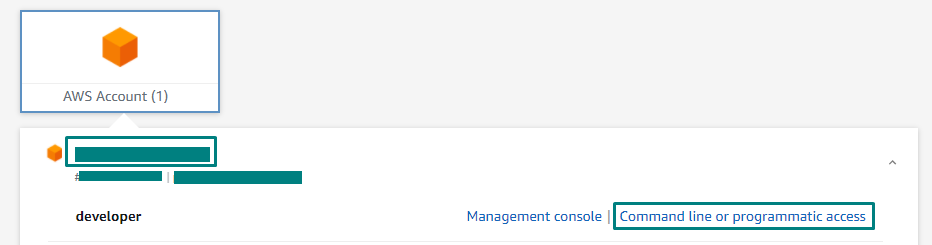
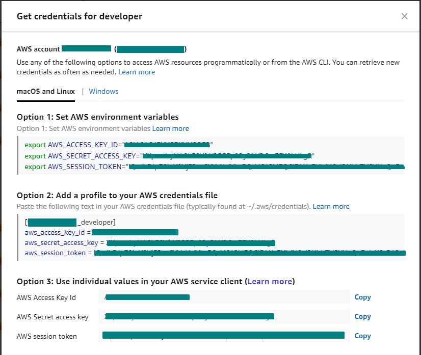

# Invest - Lambdas - Guia de Contribuição <!-- omit in toc -->

## Índice <!-- omit in toc -->

- [Requisitos](#requisitos)
- [Executando o projeto](#executando-o-projeto)
  - [Executando uma função Lambda localmente](#executando-uma-função-lambda-localmente)
    - [Alterar variáveis de ambiente](#alterar-variáveis-de-ambiente)
  - [Executando testes](#executando-testes)
- [Configurando o Git](#configurando-o-git)
- [Configurando as credenciais AWS](#configurando-as-credenciais-aws)
- [IDEs recomendadas](#ides-recomendadas)
  - [VSCode](#vscode)

## Requisitos

- [NodeJs 12.x+][node] e [NPM 6.x+][npm]
- [Git][git]
- [AWS Cli][awscli]
- Credenciais AWS

## Executando o projeto

Instalar dependências:

```bash
$ npm install
```

### Executando uma função Lambda localmente

Em um ambiente real, as funções Lambdas são executadas dentro da AWS, entretanto, é possível executá-las localmente. A forma mais fácil para isso é utilizar o comando [lambda-local].

No projeto, as definições das Lambdas são escritas no arquivo [templates\samTemplate.yaml](templates\samTemplate.yaml) e sua implementação inicia em um _request handler_ por convenção declarado na pasta `app/request`. A mairoria das Lambdas dependem de parâmetros de inicialização, no ambiente AWS esses parâmetros são passados através de um evento, em casos de teste, são utilizados arquivos JSON representando estes eventos.

Instalar o **lambda-local** globalmente:

```bash
$ npm i -g lambda-local
```

Exemplo de execução de Lambda com o lambda-local:

```bash
$ lambda-local -l app/request/stock-request.js -h add -e stock-event.json -t 300
```

Sendo:

- **app/request/stock-request.js** = arquivo JS onde estão declaradas as funções handlers
- **add** = nome do handler
- **stock-event.json** = Path do JSON utilizado como parâmetro de inicialização

#### Alterar variáveis de ambiente

Para sobrescrever as variáveis de ambiente retornadas pelo Secret Manager, basta informar o JSON em formato **string** na variável de ambiente `CONFIG` ao executar a lambda. Utilizando o `lambda-local` a variável é informada pela opção `-E` ou `--environment`:

```bash
$ lambda-local -l app/request/stock-request.js -h add -e stock-event.json -t 300 -E
'{"CONFIG": "{\"api\":{\"base_url\":\"http://localhost:9001/mock-api\"}}"}'
```

Exemplo das configurações que podem ser sobrescritas:

```json
{
  "rds": {
    "connectionLimit": 30,
    "host": "host",
    "port": "port",
    "user": "user",
    "password": "password",
    "database": "database"
  }
}
```

### Executando testes

A execução de todos os testes do projeto pode ser realizada pelo comando:

```bash
$ npm run test
```

Para executar apenas um teste ou um conjunto de testes:

```bash
$ npm run test -- -g '<nome_do_teste>'
```

Obs.: A execução dos testes depende da [configuração das credenciais AWS](#configurando-as-credenciais-aws).

## Configurando o Git

Este passo é necessário caso você utilize o <b>Git For Windows</b>. Por padrão o Windows utiliza os caracteres fim-de-linha no padrão CRLF, os fontes do projeto estão utilizando LF, padrão Unix.

Portanto, é necessário configurar o padrão de terminação de linhas com o comando:

```bash
$ git config --global core.autocrlf true
```

Ou caso queira configurar apenas ao repositório local, posicionado na pasta raís do projeto execute o comando:

```bash
$ git config core.autocrlf true
```

## Configurando as credenciais AWS

Para executar as aplicações, é necessário configurar as credenciais de acesso ao ambiente da AWS, **todas** as configurações estão presentes no **AWS SecretManager** e serão acessados ao executar alguma aplicação.

Para este passo, você irá precisar de um acesso válido ao ambiente AWS da Cateno.

1. Logar no Single Sign-On da AWS, e obter as chaves para o conta em ambiente **Desenvolvimento** e gerar as credenciais de acesso:

   

2. Copiar as credenciais:
   

3. Copiar os comandos da Opção 1 destacada na imagem. basta clicar nas credenciais e colar os três comandos no terminal de comandos do sistema (optando por "macOS and Linux" ou "Windows").

   Opcionalmente, pode ser configurado através do [AWS Cli][awscli]:

   ```bash
   $ aws configure
   AWS Access Key ID: <access_key_id>
   AWS Secret Access Key: <secret_access_key>
   Default region name: us-east-1
   Default output format: json
   ```

   Este comando irá criar os arquivos contendo as credenciais e as configurações da AWS dentro da pasta do usuário do sistema, `~/.aws/credentials` e `~/.aws/config`, respectivamente.

   Obs: As chaves possuem um tempo de expiração limitado. Pode ser necessário atualizar as variáveis mais de uma vez no dia.

   Obs 2: É importante configurar a região para **us-east-1** (N. Virginia), caso contrário, nenhuma configuração será encontrada.

## IDEs recomendadas

### VSCode

[Visual Studio Code][vscode]

<b>Plugins:</b>

- [ESLint][eslint]
- [EditorConfig for VS Code][editorconfig]

<b>Configurações:</b>

Pode ser necessário configurar o estilo do End of Line dentro de um arquivo, para isso, na barra inferior da IDE, clicar sobre "CRLF" e selecionar "LF".

[lambda-local]: https://www.npmjs.com/package/lambda-local
[eslint]: https://marketplace.visualstudio.com/items?itemName=dbaeumer.vscode-eslint
[editorconfig]: https://marketplace.visualstudio.com/items?itemName=EditorConfig.EditorConfig
[git]: https://git-scm.com/
[node]: https://nodejs.org/en/download/
[npm]: https://www.npmjs.com/
[vscode]: https://code.visualstudio.com/download
[awscli]: https://aws.amazon.com/pt/cli/
